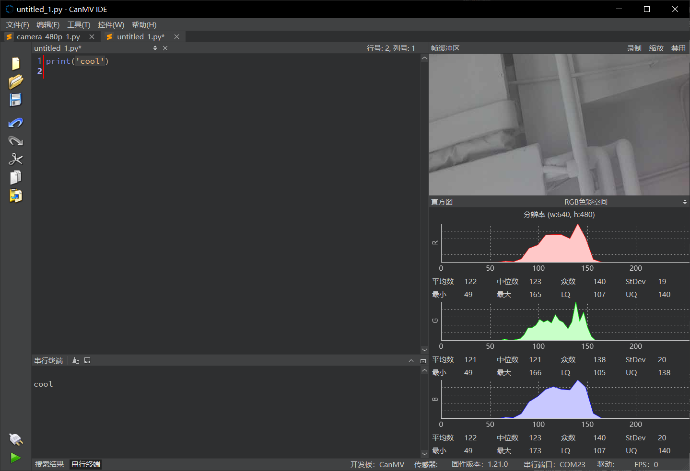
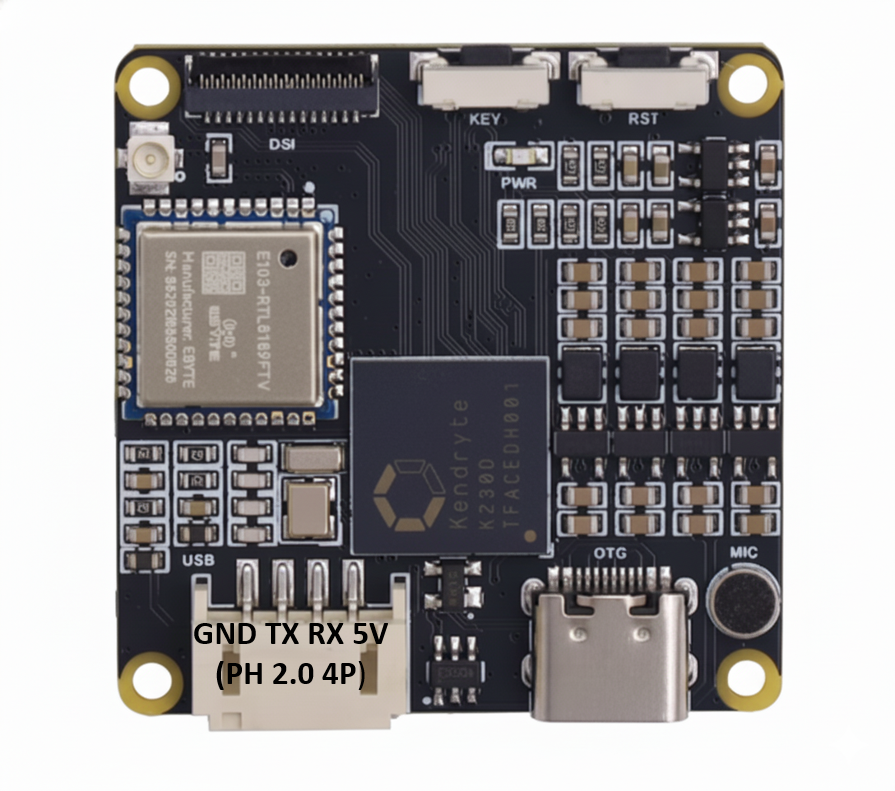

# ACM001 Quick Start Tutorial
## 1. Flash the System Image

To prepare your ACM001 for its first boot:

1. Prepare a **Micro SD card** (Class 10 or higher is recommended).
2. Download the [image file](https://drive.google.com/file/d/1tEXIpkWGTMnGrNFrlngonsHkIB-k90gc/view?usp=drive_link) for ACM001 **.img** file from the provided resource link.
3. Use a [flashing tool](https://drive.google.com/file/d/1tzLAZv9YU90UY3_GhxZIzeGX_PcaMhgb/view?usp=drive_link) to write the `.img` file to the SD card.
4. Insert the card into the ACM001 slot and power on the device.

## 2. Connect ACM001 to CanMV IDE
### CanMV IDE Installation

Please follow the official instructions to install the [CanMV IDE](https://www.kendryte.com/en/resource/ide,k230) on your laptop. This IDE is specifically designed to develop and debug Python scripts for the K230-based ACM001 hardware.

### Connect ACM001 to your computer

Please connect ACM001 to your computer over two USB cables.

## 3. Run Your First Example

Once the device is connected to the CanMV IDE, you can verify the connection by running this simple script:
Before running the code, you first need to open a code file in the editor. Once the file is open, click the “Run” button at the bottom left to run the current file. For example, when running the print('cool') code, the output cool will be displayed in the serial terminal.
```python
print("cool")

```

---

## 4. UART Communication

The ACM001 can act as an edge AI device by sending processed data to an external MCU or a PC via UART. The UART pin definitions for the ACM001 are shown in the image below:



**Note:** Ensure you connect the ACM001 **TX** to the external device **RX**, and ACM001 **RX** to the external device **TX**.
This script demonstrates the fundamental process of setting up hardware pins and managing serial data on the ACM001.

```python
from machine import UART
from machine import FPIOA
import time

fpioa = FPIOA()

# UART2 Initialize: Pin 44 as TX, Pin 45 as RX
fpioa.set_function(44, FPIOA.UART2_TXD)
fpioa.set_function(45, FPIOA.UART2_RXD)

uart = UART(UART.UART2, 115200) # Configure Baudrate to 115200

while True:
    text = uart.read(32) # Read up to 32 bytes
    if text:
        print("Received:", text)
    
    uart.write('Testing')
    time.sleep(0.1) # 100ms delay

```

---

## 5. Run Your First AI Model

The following script demonstrates a sophisticated **Hand Detection and Keypoint Tracking** task. It utilizes the onboard AI accelerator to process camera frames and identifies hand positions and skeletal joints.

**Prerequisites:** Ensure the required `.kmodel` files are stored in `/sdcard/examples/kmodel/`.

```python
from libs.PipeLine import PipeLine
from libs.AIBase import AIBase
from libs.AI2D import Ai2d
from libs.Utils import *
import os, sys, ujson, gc, math
from media.media import *
import nncase_runtime as nn
import ulab.numpy as np
import image
import aicube
from machine import UART
from machine import FPIOA
import time

# UART Initialization
fpioa = FPIOA()
fpioa.set_function(44, FPIOA.UART2_TXD)
fpioa.set_function(45, FPIOA.UART2_RXD)
uart = UART(UART.UART2, 115200)

# Define the Hand Detection Task
class HandDetApp(AIBase):
    def __init__(self, kmodel_path, labels, model_input_size, anchors, confidence_threshold=0.2, nms_threshold=0.5, nms_option=False, strides=[8,16,32], rgb888p_size=[1920,1080], display_size=[1920,1080], debug_mode=0):
        super().__init__(kmodel_path, model_input_size, rgb888p_size, debug_mode)
        self.labels = labels
        self.model_input_size = model_input_size
        self.confidence_threshold = confidence_threshold
        self.nms_threshold = nms_threshold
        self.anchors = anchors
        self.strides = strides
        self.nms_option = nms_option
        self.rgb888p_size = [ALIGN_UP(rgb888p_size[0], 16), rgb888p_size[1]]
        self.display_size = [ALIGN_UP(display_size[0], 16), display_size[1]]
        self.ai2d = Ai2d(debug_mode)
        self.ai2d.set_ai2d_dtype(nn.ai2d_format.NCHW_FMT, nn.ai2d_format.NCHW_FMT, np.uint8, np.uint8)

    def config_preprocess(self, input_image_size=None):
        ai2d_input_size = input_image_size if input_image_size else self.rgb888p_size
        top, bottom, left, right, _ = center_pad_param(self.rgb888p_size, self.model_input_size)
        self.ai2d.pad([0, 0, 0, 0, top, bottom, left, right], 0, [114, 114, 114])
        self.ai2d.resize(nn.interp_method.tf_bilinear, nn.interp_mode.half_pixel)
        self.ai2d.build([1, 3, ai2d_input_size[1], ai2d_input_size[0]], [1, 3, self.model_input_size[1], self.model_input_size[0]])

    def postprocess(self, results):
        dets = aicube.anchorbasedet_post_process(results[0], results[1], results[2], self.model_input_size, self.rgb888p_size, self.strides, len(self.labels), self.confidence_threshold, self.nms_threshold, self.anchors, self.nms_option)
        return dets

# Define the Hand Keypoint Detection Task
class HandKPDetApp(AIBase):
    def __init__(self, kmodel_path, model_input_size, rgb888p_size=[1920,1080], display_size=[1920,1080], debug_mode=0):
        super().__init__(kmodel_path, model_input_size, rgb888p_size, debug_mode)
        self.model_input_size = model_input_size
        self.rgb888p_size = [ALIGN_UP(rgb888p_size[0], 16), rgb888p_size[1]]
        self.display_size = [ALIGN_UP(display_size[0], 16), display_size[1]]
        self.crop_params = []
        self.ai2d = Ai2d(debug_mode)
        self.ai2d.set_ai2d_dtype(nn.ai2d_format.NCHW_FMT, nn.ai2d_format.NCHW_FMT, np.uint8, np.uint8)

    def config_preprocess(self, det, input_image_size=None):
        ai2d_input_size = input_image_size if input_image_size else self.rgb888p_size
        self.crop_params = self.get_crop_param(det)
        self.ai2d.crop(self.crop_params[0], self.crop_params[1], self.crop_params[2], self.crop_params[3])
        self.ai2d.resize(nn.interp_method.tf_bilinear, nn.interp_mode.half_pixel)
        self.ai2d.build([1, 3, ai2d_input_size[1], ai2d_input_size[0]], [1, 3, self.model_input_size[1], self.model_input_size[0]])

    def postprocess(self, results):
        results = results[0].reshape(results[0].shape[0] * results[0].shape[1])
        results_show = np.zeros(results.shape, dtype=np.int16)
        results_show[0::2] = results[0::2] * self.crop_params[3] + self.crop_params[0]
        results_show[1::2] = results[1::2] * self.crop_params[2] + self.crop_params[1]
        results_show[0::2] = results_show[0::2] * (self.display_size[0] / self.rgb888p_size[0])
        results_show[1::2] = results_show[1::2] * (self.display_size[1] / self.rgb888p_size[1])
        return results_show

    def get_crop_param(self, det_box):
        x1, y1, x2, y2 = det_box[2], det_box[3], det_box[4], det_box[5]
        w, h = int(x2 - x1), int(y2 - y1)
        length = max(w, h) / 2
        cx, cy = (x1 + x2) / 2, (y1 + y2) / 2
        ratio_num = 1.26 * length
        x1_kp = int(max(0, cx - ratio_num))
        y1_kp = int(max(0, cy - ratio_num))
        x2_kp = int(min(self.rgb888p_size[0] - 1, cx + ratio_num))
        y2_kp = int(min(self.rgb888p_size[1] - 1, cy + ratio_num))
        return [x1_kp, y1_kp, int(x2_kp - x1_kp + 1), int(y2_kp - y1_kp + 1)]

# Main Controller for Hand Keypoint Detection
class HandKeyPointDet:
    def __init__(self, hand_det_kmodel, hand_kp_kmodel, det_input_size, kp_input_size, labels, anchors, confidence_threshold=0.25, nms_threshold=0.3, nms_option=False, strides=[8,16,32], rgb888p_size=[1280,720], display_size=[1920,1080], debug_mode=0):
        self.rgb888p_size = [ALIGN_UP(rgb888p_size[0], 16), rgb888p_size[1]]
        self.display_size = [ALIGN_UP(display_size[0], 16), display_size[1]]
        self.hand_det = HandDetApp(hand_det_kmodel, labels, det_input_size, anchors, confidence_threshold, nms_threshold, nms_option, strides, rgb888p_size, display_size, debug_mode)
        self.hand_kp = HandKPDetApp(hand_kp_kmodel, kp_input_size, rgb888p_size, display_size)
        self.hand_det.config_preprocess()

    def run(self, input_np):
        det_boxes = self.hand_det.run(input_np)
        hand_res, boxes = [], []
        for det_box in det_boxes:
            x1, y1, x2, y2 = det_box[2], det_box[3], det_box[4], det_box[5]
            if (int(y2 - y1) < (0.1 * self.rgb888p_size[1])): continue
            self.hand_kp.config_preprocess(det_box)
            hand_res.append(self.hand_kp.run(input_np))
            boxes.append(det_box)
        return boxes, hand_res

    def draw_result(self, pl, dets, hand_res):
        pl.osd_img.clear()
        for k in range(len(dets)):
            det_box = dets[k]
            x_det = int(det_box[2] * self.display_size[0] // self.rgb888p_size[0])
            y_det = int(det_box[3] * self.display_size[1] // self.rgb888p_size[1])
            w_det = int((det_box[4] - det_box[2]) * self.display_size[0] // self.rgb888p_size[0])
            h_det = int((det_box[5] - det_box[3]) * self.display_size[1] // self.rgb888p_size[1])
            pl.osd_img.draw_rectangle(x_det, y_det, w_det, h_det, color=(255, 0, 255, 0), thickness=2)
            
            res = hand_res[k]
            for i in range(len(res) // 2):
                pl.osd_img.draw_circle(res[i*2], res[i*2+1], 1, color=(255, 0, 255, 0))

if __name__ == "__main__":
    display_mode = "none"
    rgb888p_size = [640, 360]
    pl = PipeLine(rgb888p_size=rgb888p_size, display_mode=display_mode)
    pl.create()
    
    hkd = HandKeyPointDet("/sdcard/examples/kmodel/hand_det.kmodel", "/sdcard/examples/kmodel/handkp_det.kmodel", [512, 512], [256, 256], ["hand"], [26,27, 53,52, 75,71, 80,99, 106,82, 99,134, 140,113, 161,172, 245,276], rgb888p_size=rgb888p_size, display_size=pl.get_display_size())
    
    try:
        while True:
            img = pl.get_frame()
            det_boxes, hand_res = hkd.run(img)
            hkd.draw_result(pl, det_boxes, hand_res)
            pl.show_image()
            gc.collect()
            
            # Simple UART echo feedback
            text = uart.read(32)
            if text:
                print("UART received data")
                uart.write('ACK')
    finally:
        pl.destroy()

```

## 6. Show the Image on the LCD Screen
```python
'''
Experiment Name: Three Image Display Methods
Experimental Platform: 01Studio CanMV K230 + 3.5-inch MIPI Screen
Description: Capture camera images and display them via IDE, HDMI, and MIPI screen
'''

import time, os, sys

from media.sensor import *  # Import sensor module to use camera-related interfaces
from media.display import *  # Import display module to use display-related interfaces
from media.media import *  # Import media module to use media-related interfaces

sensor = Sensor()  # Create a camera object
sensor.reset()  # Reset and initialize the camera

# sensor.set_framesize(Sensor.FHD)  # Set frame size to FHD (1920x1080), for buffer and HDMI, default channel 0
sensor.set_framesize(width=800, height=480)  # Set frame size to 800x480, dedicated for LCD, default channel 0
sensor.set_pixformat(Sensor.RGB565)  # Set output image format, default channel 0

#################################
## Three different image display methods (modify comments to enable)
#################################

# Display.init(Display.VIRT, sensor.width(), sensor.height(), to_ide=True)  # Display image via IDE buffer
# Display.init(Display.LT9611, to_ide=True)  # Display image via HDMI
Display.init(Display.ST7701, to_ide=True)  # Display image via 01Studio 3.5-inch MIPI display

MediaManager.init()  # Initialize media resource manager

sensor.run()  # Start the sensor

clock = time.clock()

while True:

    ####################
    ## Write main code here
    ####################
    clock.tick()

    img = sensor.snapshot()  # Capture one image

    Display.show_image(img)  # Display the image

    print(clock.fps())  # Print FPS
```

For further information(Python API, Example, IDE), please visit the official [documentation](https://www.kendryte.com/k230_canmv/en/main/index.html)

